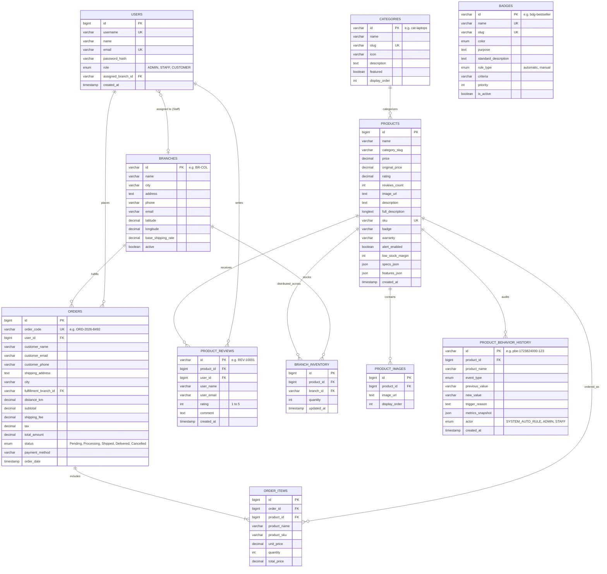

# ETech Computers — Backend API Integration & Spring Boot / MySQL Migration Specification

> **Master Specification Document**: This document serves as the authoritative blueprint for transitioning the ETech Computers Online Store frontend from client-side mock datasets and `localStorage` to a production-ready **Spring Boot REST API** backed by a **MySQL Database**.
> 
> *Maintained and updated to reflect all frontend data models, taxonomy engines, stock matrix workflows, rating systems, AI assistants, and administration modules.*

---

## Table of Contents
1. [System Architecture: Current vs. Target Backend](#1-system-architecture-current-vs-target-backend)
2. [Current `localStorage` Keys & Mock Repositories](#2-current-localstorage-keys--mock-repositories)
3. [Entity Relationship Diagram (ERD)](#3-entity-relationship-diagram-erd)
4. [MySQL Relational Database Schema (DDL)](#4-mysql-relational-database-schema-ddl)
5. [Spring Boot REST Endpoints Specification](#5-spring-boot-rest-endpoints-specification)
   - [Auth & User Management (`/api/v1/auth`, `/api/v1/users`)](#auth--user-management)
   - [Product Catalog & Gallery (`/api/v1/products`)](#product-catalog--gallery)
   - [Product Ratings & Reviews (`/api/v1/reviews`)](#product-ratings--reviews)
   - [Categories & Storefront Taxonomy (`/api/v1/categories`)](#categories--storefront-taxonomy)
   - [Badges & Automated Rules Engine (`/api/v1/badges`)](#badges--automated-rules-engine)
   - [Product Behavior History & Audit Logs (`/api/v1/product-behavior-history`)](#product-behavior-history--audit-logs)
   - [Branch Warehouses (`/api/v1/branches`)](#branch-warehouses)
   - [Stock Health & Inventory Alerts (`/api/v1/inventory`)](#stock-health--inventory-alerts)
   - [Orders & Fulfillment (`/api/v1/orders`)](#orders--fulfillment)
   - [Store Profile & Legal Policies (`/api/v1/business-profile`, `/api/v1/policies`)](#store-profile--legal-policies)
   - [AI Chatbot & Support Assistant (`/api/v1/chat`)](#ai-chatbot--support-assistant)
   - [Financial Analytics & Reports (`/api/v1/analytics`)](#financial-analytics--reports)
6. [Spring Boot Application Architecture & Dependencies](#6-spring-boot-application-architecture--dependencies)
7. [Client-Side Simplifications & Role-Based UI Security (RBAC)](#7-client-side-simplifications--role-based-ui-security-rbac)
8. [Frontend API Service Layer Architecture (`src/js/api/`)](#8-frontend-api-service-layer-architecture-srcjsapi)
9. [Step-by-Step Backend Migration & Cutover Checklist](#9-step-by-step-backend-migration--cutover-checklist)

---

## 1. System Architecture: Current vs. Target Backend

```mermaid
flowchart TD
    subgraph Frontend["Frontend SPA (HTML5 / Vanilla JS / Tailwind CSS)"]
        UI["UI Layer (index.html, DOM Renderers, Modals)"]
        Controllers["Controllers (shop, cart, product-details, taxonomy, stock_health, auth, admin, policies)"]
        APILayer["API Service Client Layer (src/js/api/)"]
    end

    subgraph Current["Current State (Mock / Client Storage)"]
        LocalStorage[("Browser localStorage\netech_products, etech_orders,\netech_branches, etech_users,\netech_policies, etech_business_info, etc.")]
    end

    subgraph Target["Target Backend (Spring Boot 3.x + MySQL 8.x)"]
        APILayer -->|HTTP / REST (JSON + JWT Bearer)| SpringSecurity["Spring Security (JWT Filter Chain)"]
        SpringSecurity --> RESTControllers["Spring REST Controllers (@RestController)"]
        RESTControllers --> Services["Business Services (@Service + @Transactional)"]
        Services --> RulesEngine["Automated Badge & Stock Rules Engine"]
        Services --> GeminiProxy["Gemini 2.0 AI Proxy Service"]
        Services --> Repositories["Spring Data JPA Repositories"]
        Repositories --> Hibernate["Hibernate ORM"]
        Hibernate --> MySQL[("MySQL 8.x Database Engine")]
    end

    Controllers -.->|Current Direct Access| LocalStorage
    Controllers -->|Future Migration Target| APILayer
```

---

## 2. Current `localStorage` Keys & Mock Repositories

| Key | Current Model / Controller File | Purpose in Client App | Target Spring Boot Endpoint(s) | Action Upon Backend Switch |
|---|---|---|---|---|
| `etech_products` | `src/js/models/data.js` | Stores all product catalog data, specs, image URLs, total stock, and branch stock breakdown | `GET /api/v1/products`<br>`POST /api/v1/products`<br>`PUT /api/v1/products/{id}`<br>`DELETE /api/v1/products/{id}` | **Replace completely** with API fetch calls. Remove manual array find/filter/save logic. |
| `etech_categories_data` | `src/js/models/taxonomy_data.js` | Stores category hierarchy, icons, slugs, descriptions, and storefront featured flags | `GET /api/v1/categories`<br>`POST /api/v1/categories`<br>`PUT /api/v1/categories/{id}`<br>`DELETE /api/v1/categories/{id}` | **Replace completely** with API fetch calls. |
| `etech_badges_data` | `src/js/models/taxonomy_data.js` | Stores badge tags, color themes, purpose descriptions, and automated reach criteria rules | `GET /api/v1/badges`<br>`POST /api/v1/badges`<br>`PUT /api/v1/badges/{id}`<br>`DELETE /api/v1/badges/{id}`<br>`POST /api/v1/badges/auto-assign` | **Replace completely** with API calls. Spring Boot service runs rule evaluations server-side. |
| `etech_product_behavior_history` | `src/js/models/taxonomy_data.js` | Stores audit log of product standard reach triggers, automated badge transitions, and manual overrides | `GET /api/v1/product-behavior-history`<br>`GET /api/v1/products/{id}/behavior-history`<br>`POST /api/v1/product-behavior-history` | **Replace completely** with database-backed audit table. |
| `etech_product_reviews` | `src/js/models/rating_data.js` | Stores 1–5 star customer text reviews, updating average ratings and total review counts | `GET /api/v1/products/{id}/reviews`<br>`POST /api/v1/products/{id}/reviews`<br>`DELETE /api/v1/reviews/{id}` | **Replace completely** with database table and relational queries. |
| `etech_branches` | `src/js/controller/branch_controller.js` | Stores regional warehouse hubs (Colombo, Galle, Matara, Kandy) with geo coordinates & base rates | `GET /api/v1/branches`<br>`POST /api/v1/branches`<br>`PUT /api/v1/branches/{id}`<br>`DELETE /api/v1/branches/{id}` | **Replace completely** with API fetch calls. |
| `etech_orders` | `src/js/controller/order_management_controller.js` | Stores customer orders, delivery distances, fulfillment branch, item arrays, and status | `GET /api/v1/orders`<br>`GET /api/v1/orders/my-orders`<br>`POST /api/v1/orders`<br>`PATCH /api/v1/orders/{id}/status` | **Replace completely** with API fetch calls. Remove client-side order ID generation. |
| `etech_users` | `src/js/controller/login_controller.js` | Stores user directory with unique username, role badges (`ADMIN`, `STAFF`, `CUSTOMER`), and branch assignments | `GET /api/v1/users`<br>`POST /api/v1/auth/register`<br>`POST /api/v1/users`<br>`PATCH /api/v1/users/{id}/role` | **Replace completely** with API calls. Spring Security manages UserDetails entities (username/password) and BCrypt passwords. |
| `etech_current_user` | `src/js/controller/login_controller.js` | Stores current logged-in user profile & role session | `POST /api/v1/auth/login`<br>`GET /api/v1/auth/me` | **Keep minimal**: Store only the **JWT Bearer Token** and cached basic user profile in `localStorage` or `sessionStorage`. |
| `etech_cart` | `src/js/controller/cart_controller.js` | Stores active shopping cart items and quantities | Optional: `GET/POST /api/v1/cart` (or keep in `localStorage` for guest sessions) | Can **remain in `localStorage`** for guest carts, syncing to backend on checkout/login. |
| `etech_business_info` | `src/js/models/policy-data.js` | Corporate business details, registration no, tax ID, ISO credentials, and hotline | `GET /api/v1/business-profile`<br>`PUT /api/v1/business-profile` | **Replace completely** with database table. |
| `etech_policies` | `src/js/models/policy-data.js` | Legal compliance policies (Privacy Policy, Terms of Service, Guarantee & Warranty) | `GET /api/v1/policies`<br>`GET /api/v1/policies/{slug}`<br>`PUT /api/v1/policies/{slug}` | **Replace completely** with database table and JSON clause collections. |

---

## 3. Entity Relationship Diagram (ERD)



---

## 4. MySQL Relational Database Schema (DDL)

```sql
-- ============================================================
-- ETech Computers — Production Relational Database Schema
-- Database Engine: MySQL 8.0+
-- ============================================================

CREATE DATABASE IF NOT EXISTS etech_computers_db 
CHARACTER SET utf8mb4 COLLATE utf8mb4_unicode_ci;

USE etech_computers_db;

-- 1. Branches Table (Regional Warehouse Hubs)
CREATE TABLE branches (
    id VARCHAR(20) PRIMARY KEY, -- e.g., 'BR-COL', 'BR-GAL', 'BR-MAT', 'BR-KAN'
    name VARCHAR(100) NOT NULL,
    city VARCHAR(100) NOT NULL,
    address TEXT NOT NULL,
    phone VARCHAR(30) NOT NULL,
    email VARCHAR(150) NOT NULL,
    latitude DECIMAL(10, 8) NOT NULL,
    longitude DECIMAL(11, 8) NOT NULL,
    base_shipping_rate DECIMAL(10, 2) NOT NULL DEFAULT 350.00,
    active BOOLEAN DEFAULT TRUE,
    created_at TIMESTAMP DEFAULT CURRENT_TIMESTAMP,
    updated_at TIMESTAMP DEFAULT CURRENT_TIMESTAMP ON UPDATE CURRENT_TIMESTAMP
) ENGINE=InnoDB;

-- 2. Users Table (Administrators, Branch Staff, & Customers)
CREATE TABLE users (
    id BIGINT AUTO_INCREMENT PRIMARY KEY,
    username VARCHAR(50) NOT NULL UNIQUE,
    name VARCHAR(100) NOT NULL,
    email VARCHAR(150) NOT NULL UNIQUE,
    password_hash VARCHAR(255) NOT NULL,
    role ENUM('ADMIN', 'STAFF', 'CUSTOMER') NOT NULL DEFAULT 'CUSTOMER',
    assigned_branch_id VARCHAR(20) NULL,
    created_at TIMESTAMP DEFAULT CURRENT_TIMESTAMP,
    updated_at TIMESTAMP DEFAULT CURRENT_TIMESTAMP ON UPDATE CURRENT_TIMESTAMP,
    FOREIGN KEY (assigned_branch_id) REFERENCES branches(id) ON DELETE SET NULL,
    INDEX idx_users_username (username),
    INDEX idx_users_email (email),
    INDEX idx_users_role (role)
) ENGINE=InnoDB;

-- 3. Categories Table (Storefront & Catalog Taxonomy)
CREATE TABLE categories (
    id VARCHAR(50) PRIMARY KEY, -- e.g. 'cat-laptops', 'cat-components'
    name VARCHAR(100) NOT NULL,
    slug VARCHAR(100) NOT NULL UNIQUE,
    icon VARCHAR(50) DEFAULT '📦',
    description TEXT,
    featured BOOLEAN DEFAULT FALSE,
    display_order INT DEFAULT 0,
    created_at TIMESTAMP DEFAULT CURRENT_TIMESTAMP,
    updated_at TIMESTAMP DEFAULT CURRENT_TIMESTAMP ON UPDATE CURRENT_TIMESTAMP,
    INDEX idx_categories_slug (slug)
) ENGINE=InnoDB;

-- 4. Badges & Automated Rules Engine Table
CREATE TABLE badges (
    id VARCHAR(50) PRIMARY KEY, -- e.g. 'bdg-bestseller', 'bdg-hot-deal'
    name VARCHAR(100) NOT NULL UNIQUE,
    slug VARCHAR(100) NOT NULL UNIQUE,
    color ENUM('blue', 'rose', 'emerald', 'amber', 'purple', 'cyan', 'orange') NOT NULL DEFAULT 'blue',
    purpose TEXT,
    standard_description TEXT,
    rule_type ENUM('automatic', 'manual') NOT NULL DEFAULT 'manual',
    criteria VARCHAR(100) DEFAULT 'custom',
    priority INT DEFAULT 10,
    is_active BOOLEAN DEFAULT TRUE,
    created_at TIMESTAMP DEFAULT CURRENT_TIMESTAMP,
    updated_at TIMESTAMP DEFAULT CURRENT_TIMESTAMP ON UPDATE CURRENT_TIMESTAMP
) ENGINE=InnoDB;

-- 5. Products Table (Master Catalog Entity)
CREATE TABLE products (
    id BIGINT AUTO_INCREMENT PRIMARY KEY,
    name VARCHAR(255) NOT NULL,
    category_slug VARCHAR(100) NOT NULL,
    price DECIMAL(12, 2) NOT NULL,
    original_price DECIMAL(12, 2) NOT NULL,
    rating DECIMAL(2, 1) DEFAULT 5.0,
    reviews_count INT DEFAULT 0,
    image_url TEXT NOT NULL,
    description TEXT,
    full_description LONGTEXT,
    sku VARCHAR(100) NOT NULL UNIQUE,
    badge VARCHAR(50) DEFAULT '',
    warranty VARCHAR(150) DEFAULT '2-Year Warranty',
    alert_enabled BOOLEAN DEFAULT TRUE,
    low_stock_margin INT DEFAULT 5,
    specs_json JSON,        -- e.g. {"Processor": "i9-14900HX", "RAM": "32GB"}
    features_json JSON,     -- e.g. ["Liquid Metal Cooling", "RGB Keyboard"]
    created_at TIMESTAMP DEFAULT CURRENT_TIMESTAMP,
    updated_at TIMESTAMP DEFAULT CURRENT_TIMESTAMP ON UPDATE CURRENT_TIMESTAMP,
    FOREIGN KEY (category_slug) REFERENCES categories(slug) ON UPDATE CASCADE,
    INDEX idx_products_sku (sku),
    INDEX idx_products_category (category_slug),
    INDEX idx_products_price (price)
) ENGINE=InnoDB;

-- 6. Product Gallery Images (Multi-Image Support, Max 5 Images)
CREATE TABLE product_images (
    id BIGINT AUTO_INCREMENT PRIMARY KEY,
    product_id BIGINT NOT NULL,
    image_url TEXT NOT NULL,
    display_order INT DEFAULT 0,
    FOREIGN KEY (product_id) REFERENCES products(id) ON DELETE CASCADE,
    INDEX idx_product_images_product (product_id)
) ENGINE=InnoDB;

-- 7. Branch Warehouse Stock Allocation (Many-to-Many Bridge)
CREATE TABLE branch_inventory (
    id BIGINT AUTO_INCREMENT PRIMARY KEY,
    product_id BIGINT NOT NULL,
    branch_id VARCHAR(20) NOT NULL,
    quantity INT NOT NULL DEFAULT 0,
    updated_at TIMESTAMP DEFAULT CURRENT_TIMESTAMP ON UPDATE CURRENT_TIMESTAMP,
    FOREIGN KEY (product_id) REFERENCES products(id) ON DELETE CASCADE,
    FOREIGN KEY (branch_id) REFERENCES branches(id) ON DELETE CASCADE,
    UNIQUE KEY unique_product_branch (product_id, branch_id),
    INDEX idx_inventory_lookup (product_id, branch_id)
) ENGINE=InnoDB;

-- 8. Product Ratings & Customer Reviews Table
CREATE TABLE product_reviews (
    id VARCHAR(50) PRIMARY KEY, -- e.g. 'REV-10001'
    product_id BIGINT NOT NULL,
    user_id BIGINT NOT NULL,
    user_name VARCHAR(100) NOT NULL,
    user_email VARCHAR(150) NOT NULL,
    rating INT NOT NULL CHECK (rating >= 1 AND rating <= 5),
    comment TEXT,
    created_at TIMESTAMP DEFAULT CURRENT_TIMESTAMP,
    updated_at TIMESTAMP DEFAULT CURRENT_TIMESTAMP ON UPDATE CURRENT_TIMESTAMP,
    FOREIGN KEY (product_id) REFERENCES products(id) ON DELETE CASCADE,
    FOREIGN KEY (user_id) REFERENCES users(id) ON DELETE CASCADE,
    UNIQUE KEY unique_user_product_review (product_id, user_id),
    INDEX idx_reviews_product (product_id)
) ENGINE=InnoDB;

-- 9. Product Behavior History & Audit Log Table
CREATE TABLE product_behavior_history (
    id VARCHAR(100) PRIMARY KEY, -- e.g. 'pbe-1723824000-123'
    product_id BIGINT NOT NULL,
    product_name VARCHAR(255) NOT NULL,
    event_type ENUM(
        'BADGE_AUTO_ASSIGNED', 
        'STANDARD_REACHED', 
        'BADGE_MANUAL_OVERRIDE', 
        'CATEGORY_CHANGED', 
        'PRICE_MARKDOWN', 
        'RESTOCK_TRIGGER'
    ) NOT NULL,
    previous_value VARCHAR(255),
    new_value VARCHAR(255),
    trigger_reason TEXT,
    metrics_snapshot JSON, -- e.g. {"price": 2499, "discountPct": 12, "stock": 4, "rating": 4.9, "reviews": 128}
    actor ENUM('SYSTEM_AUTO_RULE', 'ADMIN', 'STAFF') NOT NULL DEFAULT 'SYSTEM_AUTO_RULE',
    created_at TIMESTAMP DEFAULT CURRENT_TIMESTAMP,
    FOREIGN KEY (product_id) REFERENCES products(id) ON DELETE CASCADE,
    INDEX idx_behavior_product (product_id),
    INDEX idx_behavior_event (event_type)
) ENGINE=InnoDB;

-- 10. Orders Table (Customer Checkout & Fulfillment)
CREATE TABLE orders (
    id BIGINT AUTO_INCREMENT PRIMARY KEY,
    order_code VARCHAR(50) NOT NULL UNIQUE, -- e.g. 'ORD-2026-8492'
    user_id BIGINT NULL,
    customer_name VARCHAR(150) NOT NULL,
    customer_email VARCHAR(150) NOT NULL,
    customer_phone VARCHAR(50) NOT NULL,
    shipping_address TEXT NOT NULL,
    city VARCHAR(100) NOT NULL,
    fulfillment_branch_id VARCHAR(20) NOT NULL,
    distance_km DECIMAL(6, 2) DEFAULT 0.0,
    subtotal DECIMAL(12, 2) NOT NULL,
    shipping_fee DECIMAL(10, 2) NOT NULL,
    tax DECIMAL(10, 2) NOT NULL,
    total_amount DECIMAL(12, 2) NOT NULL,
    status ENUM('Pending', 'Processing', 'Shipped', 'Delivered', 'Cancelled') NOT NULL DEFAULT 'Pending',
    payment_method VARCHAR(50) NOT NULL DEFAULT 'Credit / Debit Card',
    order_date TIMESTAMP DEFAULT CURRENT_TIMESTAMP,
    updated_at TIMESTAMP DEFAULT CURRENT_TIMESTAMP ON UPDATE CURRENT_TIMESTAMP,
    FOREIGN KEY (user_id) REFERENCES users(id) ON DELETE SET NULL,
    FOREIGN KEY (fulfillment_branch_id) REFERENCES branches(id),
    INDEX idx_orders_code (order_code),
    INDEX idx_orders_user (user_id),
    INDEX idx_orders_status (status),
    INDEX idx_orders_date (order_date)
) ENGINE=InnoDB;

-- 11. Order Items Table
CREATE TABLE order_items (
    id BIGINT AUTO_INCREMENT PRIMARY KEY,
    order_id BIGINT NOT NULL,
    product_id BIGINT NOT NULL,
    product_name VARCHAR(255) NOT NULL,
    product_sku VARCHAR(100) NOT NULL,
    unit_price DECIMAL(12, 2) NOT NULL,
    quantity INT NOT NULL,
    total_price DECIMAL(12, 2) NOT NULL,
    FOREIGN KEY (order_id) REFERENCES orders(id) ON DELETE CASCADE,
    FOREIGN KEY (product_id) REFERENCES products(id),
    INDEX idx_order_items_order (order_id)
) ENGINE=InnoDB;

-- 12. Business Profile Table (Store Credentials & Operations Matrix)
CREATE TABLE business_profile (
    id INT PRIMARY KEY DEFAULT 1,
    store_name VARCHAR(150) NOT NULL,
    tagline VARCHAR(255),
    registration_no VARCHAR(100) NOT NULL,
    tax_id VARCHAR(100) NOT NULL,
    iso_cert VARCHAR(150),
    support_email VARCHAR(150) NOT NULL,
    hotline VARCHAR(100) NOT NULL,
    headquarters TEXT NOT NULL,
    working_hours VARCHAR(255),
    mission_statement TEXT,
    company_story TEXT,
    updated_at TIMESTAMP DEFAULT CURRENT_TIMESTAMP ON UPDATE CURRENT_TIMESTAMP
) ENGINE=InnoDB;

-- 13. Legal Policies Table (Privacy, Terms, Guarantee & Warranty)
CREATE TABLE legal_policies (
    id VARCHAR(50) PRIMARY KEY, -- 'privacy', 'terms', 'warranty'
    title VARCHAR(150) NOT NULL,
    subtitle VARCHAR(255),
    last_updated VARCHAR(50),
    sections_json JSON NOT NULL, -- Array of { heading, content, bullets[] }
    updated_at TIMESTAMP DEFAULT CURRENT_TIMESTAMP ON UPDATE CURRENT_TIMESTAMP
) ENGINE=InnoDB;
```

---

## 5. Spring Boot REST Endpoints Specification

All endpoints are prefixed with `/api/v1`.

### Auth & User Management

| Method | Endpoint | Access | Description | Request Payload | Response Payload |
|---|---|---|---|---|---|
| `POST` | `/api/v1/auth/login` | Public | Authenticate user via username/password & issue JWT | `{ "username": "admin", "password": "..." }` | `{ "token": "jwt.token...", "user": { "id": 1, "username": "admin", "name": "System Admin", "email": "admin@etech.com", "role": "ADMIN" } }` |
| `POST` | `/api/v1/auth/register` | Public | Register new customer account | `{ "name": "...", "username": "...", "email": "...", "password": "..." }` | `{ "token": "jwt.token...", "user": { "id": 4, "username": "...", "name": "...", "email": "...", "role": "CUSTOMER" } }` |
| `GET` | `/api/v1/auth/me` | Authenticated | Retrieve current session profile | Headers: `Authorization: Bearer <token>` | `{ "id": 1, "username": "admin", "name": "System Admin", "email": "admin@etech.com", "role": "ADMIN", "assignedBranch": null }` |
| `PUT` | `/api/v1/users/me/profile` | Authenticated | Update current user's name, username, and email | `{ "name": "Kasun Perera", "username": "kasun_p", "email": "kasun@gmail.com" }` | Updated User Profile DTO |
| `PUT` | `/api/v1/users/me/password` | Authenticated | Change current user's password | `{ "currentPassword": "...", "newPassword": "..." }` | `{ "success": true, "message": "Password changed" }` |
| `GET` | `/api/v1/users` | `ADMIN` | List all system users | Query: `?role=STAFF&branch=BR-COL` | `[ { "id": 1, "username": "admin", "name": "System Admin", "email": "admin@etech.com", "role": "STAFF", "assignedBranch": "BR-GAL", "createdAt": "..." } ]` |
| `POST` | `/api/v1/users` | `ADMIN` | Create new Admin / Staff account | `{ "name": "...", "username": "...", "email": "...", "password": "...", "role": "STAFF", "assignedBranch": "BR-GAL" }` | Created User DTO |
| `PUT` | `/api/v1/users/{id}` | `ADMIN` | Update user details, username & branch | `{ "name": "...", "username": "...", "email": "...", "assignedBranch": "BR-MAT" }` | Updated User DTO |
| `PATCH` | `/api/v1/users/{id}/role` | `ADMIN` | Fast role/branch update | `{ "role": "ADMIN", "assignedBranch": null }` | Updated User DTO |
| `DELETE` | `/api/v1/users/{id}` | `ADMIN` | Delete user account | None | `{ "success": true, "message": "User deleted" }` |

### Product Catalog & Gallery

| Method | Endpoint | Access | Description | Request Payload | Response Payload |
|---|---|---|---|---|---|
| `GET` | `/api/v1/products` | Public | Fetch catalog with filters, search, pagination, and branch inventory breakdown | Query params:<br>`?category=laptops`<br>`&search=rtx`<br>`&minPrice=1000`<br>`&maxPrice=5000`<br>`&badge=bestseller`<br>`&page=0&size=20` | `{ "content": [ { "id": 1, "name": "Apex Raider", "sku": "ET-LPT-001", "price": 2499, "branchStock": {"BR-COL": 11, "BR-GAL": 5}, "totalStock": 21, "images": [...] } ], "totalPages": 2, "totalElements": 24 }` |
| `GET` | `/api/v1/products/{id}` | Public | Get single product with full specs, features, images, and reviews | None | Single Product DTO |
| `GET` | `/api/v1/products/sku/{sku}` | Public | Lookup product by unique SKU | None | Single Product DTO |
| `POST` | `/api/v1/products` | `ADMIN, STAFF` | Create new product with specs, up to 5 images, and branch stock allocation | Product Form DTO | Created Product DTO |
| `PUT` | `/api/v1/products/{id}` | `ADMIN, STAFF` | Update product specs, pricing, gallery images, and stock | Product Form DTO | Updated Product DTO |
| `DELETE` | `/api/v1/products/{id}` | `ADMIN` | Remove product from store | None | `{ "success": true, "message": "Product removed" }` |

### Product Ratings & Reviews

| Method | Endpoint | Access | Description | Request Payload | Response Payload |
|---|---|---|---|---|---|
| `GET` | `/api/v1/products/{id}/reviews` | Public | List all customer reviews for a product | Query: `?page=0&size=10` | `[ { "id": "REV-10001", "productId": 1, "userId": 2, "userName": "Kasun P.", "rating": 5, "comment": "Amazing laptop...", "createdAt": "..." } ]` |
| `POST` | `/api/v1/products/{id}/reviews` | Authenticated | Submit or update user review. Automatically recalculates product average rating & triggers rule engine | `{ "rating": 5, "comment": "Outstanding build quality and cooling." }` | `{ "review": { ... }, "updatedProductRating": 4.9, "totalReviews": 128 }` |
| `GET` | `/api/v1/products/{id}/reviews/my-review` | Authenticated | Check if current user has already reviewed this product | Headers: `Authorization: Bearer <token>` | Single Review DTO or `404 Not Found` |
| `DELETE` | `/api/v1/reviews/{id}` | `ADMIN` or Owner | Delete customer review | None | `{ "success": true, "message": "Review deleted" }` |

### Categories & Storefront Taxonomy

| Method | Endpoint | Access | Description | Request Payload | Response Payload |
|---|---|---|---|---|---|
| `GET` | `/api/v1/categories` | Public | List all categories with icons, slugs, and featured flags | None | `[ { "id": "cat-laptops", "name": "Laptops & Notebooks", "slug": "laptops", "icon": "💻", "featured": true, "productCount": 6 } ]` |
| `GET` | `/api/v1/categories/{slug}` | Public | Get single category metadata | None | Category DTO |
| `POST` | `/api/v1/categories` | `ADMIN` | Create new catalog category | `{ "name": "Handhelds", "slug": "handhelds", "icon": "🎮", "description": "...", "featured": true }` | Created Category DTO |
| `PUT` | `/api/v1/categories/{id}` | `ADMIN` | Update category details | Category DTO | Updated Category DTO |
| `DELETE` | `/api/v1/categories/{id}` | `ADMIN` | Delete category (validates no active products assigned) | None | `{ "success": true, "message": "Category deleted" }` |

### Badges & Automated Rules Engine

| Method | Endpoint | Access | Description | Request Payload | Response Payload |
|---|---|---|---|---|---|
| `GET` | `/api/v1/badges` | Public | List all badges, color styles, and automated criteria | None | `[ { "id": "bdg-bestseller", "name": "Bestseller", "color": "blue", "ruleType": "automatic", "criteria": "bestseller", "isActive": true } ]` |
| `POST` | `/api/v1/badges` | `ADMIN` | Create new badge & rule | Badge DTO | Created Badge DTO |
| `PUT` | `/api/v1/badges/{id}` | `ADMIN` | Update badge rule, priority, or color | Badge DTO | Updated Badge DTO |
| `DELETE` | `/api/v1/badges/{id}` | `ADMIN` | Remove badge | None | `{ "success": true, "message": "Badge removed" }` |
| `POST` | `/api/v1/badges/auto-assign` | `ADMIN, STAFF` | **Execute Automated Rules Engine**: Scans product metrics (sales, reviews, ratings, margins), reassigns badges, and logs to behavior audit history | None | `{ "evaluatedCount": 18, "assignedCount": 5, "changes": [...] }` |

### Product Behavior History & Audit Logs

| Method | Endpoint | Access | Description | Request Payload | Response Payload |
|---|---|---|---|---|---|
| `GET` | `/api/v1/product-behavior-history` | `ADMIN, STAFF` | Global paginated timeline of automated rule triggers, price adjustments, and badge transitions | Query: `?page=0&size=50&eventType=BADGE_AUTO_ASSIGNED` | `[ { "id": "pbe-...", "productId": 1, "productName": "Apex Raider", "eventType": "BADGE_AUTO_ASSIGNED", "triggerReason": "Reached 80+ reviews with 4.8 rating", "actor": "SYSTEM_AUTO_RULE", "createdAt": "..." } ]` |
| `GET` | `/api/v1/products/{id}/behavior-history` | `ADMIN, STAFF` | Audit timeline for a specific product | None | List of Product Behavior Events |
| `POST` | `/api/v1/product-behavior-history` | `ADMIN, STAFF` | Manually log an administrative audit event | Event DTO | Created Audit Record |

### Branch Warehouses

| Method | Endpoint | Access | Description | Request Payload | Response Payload |
|---|---|---|---|---|---|
| `GET` | `/api/v1/branches` | Public | List all warehouse locations with geo coordinates & shipping rates | None | `[ { "id": "BR-COL", "name": "Colombo Main Hub", "city": "Colombo", "latitude": 6.9271, "longitude": 79.8612, "baseShippingRate": 350.00 } ]` |
| `GET` | `/api/v1/branches/{id}` | Public | Get single branch details | None | Branch DTO |
| `POST` | `/api/v1/branches` | `ADMIN` | Add new regional warehouse | Branch DTO | Created Branch DTO |
| `PUT` | `/api/v1/branches/{id}` | `ADMIN` | Update branch contact or coordinates | Branch DTO | Updated Branch DTO |
| `DELETE` | `/api/v1/branches/{id}` | `ADMIN` | Decommission branch | None | `{ "success": true }` |
| `POST` | `/api/v1/branches/nearest` | Public | Calculate nearest branch given customer coordinates / city | `{ "city": "Galle", "latitude": 6.0535, "longitude": 80.2210 }` | `{ "branch": { ... }, "distanceKm": 4.2, "shippingFee": 450.00 }` |

### Stock Health & Inventory Alerts

| Method | Endpoint | Access | Description | Request Payload | Response Payload |
|---|---|---|---|---|---|
| `GET` | `/api/v1/inventory/health-report` | `ADMIN, STAFF` | Stock health overview: branch metrics, depleted SKUs, low-stock threshold alerts | Query: `?branch=BR-COL` | `{ "totalMonitored": 18, "depletedCount": 2, "lowStockCount": 3, "branchHealth": {...}, "alerts": [...] }` |
| `PATCH` | `/api/v1/inventory/{productId}/settings` | `ADMIN, STAFF` | Toggle alert monitoring & configure low-stock margin | `{ "alertEnabled": true, "lowStockMargin": 8 }` | Updated Product Inventory Settings |
| `POST` | `/api/v1/inventory/{productId}/adjust` | `ADMIN, STAFF` | Quick restock or adjust branch warehouse quantity | `{ "branchId": "BR-GAL", "quantityDelta": 10 }` | Updated Inventory DTO |
| `POST` | `/api/v1/inventory/transfer` | `ADMIN` | Transfer stock units between regional warehouses | `{ "productId": 1, "fromBranchId": "BR-COL", "toBranchId": "BR-GAL", "quantity": 5 }` | `{ "success": true, "message": "Transferred 5 units successfully" }` |

### Orders & Fulfillment

| Method | Endpoint | Access | Description | Request Payload | Response Payload |
|---|---|---|---|---|---|
| `GET` | `/api/v1/orders` | `ADMIN, STAFF` | List all orders with filters (`?status=Pending&branch=BR-COL`) | None | `[ { "id": 1, "orderCode": "ORD-2026-8492", "customerName": "...", "totalAmount": 2499, "status": "Pending", "items": [...] } ]` |
| `GET` | `/api/v1/orders/my-orders` | Authenticated | List orders placed by logged-in customer | Headers: `Authorization: Bearer <token>` | List of customer orders |
| `GET` | `/api/v1/orders/{orderCode}` | Authenticated / Staff | Get full order details & item tracking | None | Full Order DTO |
| `POST` | `/api/v1/orders` | Public / Auth | **Place New Order**: Atomic `@Transactional` operation that validates price, creates order record, and deducts branch warehouse stock | `{ "customerName": "...", "email": "...", "phone": "...", "city": "Colombo", "shippingAddress": "...", "fulfillmentBranchId": "BR-COL", "items": [ { "productId": 1, "quantity": 1 } ], "paymentMethod": "Credit / Debit Card" }` | Created Order DTO with confirmed `orderCode` |
| `PATCH` | `/api/v1/orders/{id}/status` | `ADMIN, STAFF` | Update order fulfillment status (`Pending` $\to$ `Processing` $\to$ `Shipped` $\to$ `Delivered` $\to$ `Cancelled`) | `{ "status": "Shipped" }` | Updated Order DTO |

### Store Profile & Legal Policies

| Method | Endpoint | Access | Description | Request Payload | Response Payload |
|---|---|---|---|---|---|
| `GET` | `/api/v1/business-profile` | Public | Retrieve official corporate profile, ISO certifications, hotline, and headquarters | None | Business Profile DTO |
| `PUT` | `/api/v1/business-profile` | `ADMIN` | Update corporate trading details, mission, and support contact info | Business Profile DTO | Updated Business Profile DTO |
| `GET` | `/api/v1/policies` | Public | List all legal policies with sections and last update dates | None | `[ { "id": "privacy", "title": "Privacy Policy", "sections": [...] } ]` |
| `GET` | `/api/v1/policies/{slug}` | Public | Retrieve single policy document (`privacy`, `terms`, `warranty`) | None | Policy Document DTO |
| `PUT` | `/api/v1/policies/{slug}` | `ADMIN` | Update policy title, subtitle, last updated date, and clauses | Policy Document DTO | Updated Policy Document DTO |

### AI Chatbot & Support Assistant

| Method | Endpoint | Access | Description | Request Payload | Response Payload |
|---|---|---|---|---|---|
| `POST` | `/api/v1/chat/message` | Public / Auth | **Backend Gemini 2.0 Proxy**: Grounds user message with live store catalog, current shopping cart, stock health, and legal policies securely on the backend without exposing API keys | `{ "message": "Can you recommend a gaming laptop under $2500 with an RTX 4080?", "history": [...], "cart": [...] }` | `{ "reply": "...", "suggestedProducts": [1, 3], "timestamp": "..." }` |

### Financial Analytics & Reports

| Method | Endpoint | Access | Description | Request Payload | Response Payload |
|---|---|---|---|---|---|
| `GET` | `/api/v1/analytics/overview` | `ADMIN` | High-level business KPIs (Gross Revenue, Total Orders, Average Order Value, Active Customers) | None | `{ "grossRevenue": 4850000.00, "totalOrders": 142, "avgOrderValue": 34154.92, "activeUsers": 89 }` |
| `GET` | `/api/v1/analytics/branch-revenue` | `ADMIN` | Revenue and order volume breakdown per regional warehouse branch | None | `[ { "branchId": "BR-COL", "branchName": "Colombo Main Hub", "orderCount": 68, "revenue": 2450000.00, "percentage": 50.5 } ]` |
| `GET` | `/api/v1/analytics/top-products` | `ADMIN` | Top selling hardware products by volume and revenue | Query: `?limit=5` | `[ { "productId": 1, "name": "Apex Raider", "unitsSold": 24, "revenue": 1440000.00 } ]` |

---

## 6. Spring Boot Application Architecture & Dependencies

### Recommended Technology Stack
- **Framework**: Spring Boot 3.2+ / 3.3+ (Java 17 or 21 LTS)
- **Security**: Spring Security 6 + JJWT (`io.jsonwebtoken:jjwt-api:0.12.5`) for stateless JWT Bearer token authentication
- **Persistence**: Spring Data JPA + Hibernate ORM + MySQL Connector/J
- **Validation**: Jakarta Bean Validation (`spring-boot-starter-validation`)
- **Productivity**: Project Lombok + MapStruct
- **AI Integration**: Spring AI / Google GenAI SDK (for Gemini 2.0 Flash Chatbot proxy)

### Recommended Maven `pom.xml` Dependencies

```xml
<dependencies>
    <!-- 1. Spring Boot Web & REST -->
    <dependency>
        <groupId>org.springframework.boot</groupId>
        <artifactId>spring-boot-starter-web</artifactId>
    </dependency>

    <!-- 2. Spring Data JPA & Hibernate -->
    <dependency>
        <groupId>org.springframework.boot</groupId>
        <artifactId>spring-boot-starter-data-jpa</artifactId>
    </dependency>

    <!-- 3. MySQL JDBC Driver -->
    <dependency>
        <groupId>com.mysql</groupId>
        <artifactId>mysql-connector-j</artifactId>
        <scope>runtime</scope>
    </dependency>

    <!-- 4. Spring Security & JWT -->
    <dependency>
        <groupId>org.springframework.boot</groupId>
        <artifactId>spring-boot-starter-security</artifactId>
    </dependency>
    <dependency>
        <groupId>io.jsonwebtoken</groupId>
        <artifactId>jjwt-api</artifactId>
        <version>0.12.5</version>
    </dependency>
    <dependency>
        <groupId>io.jsonwebtoken</groupId>
        <artifactId>jjwt-impl</artifactId>
        <version>0.12.5</version>
        <scope>runtime</scope>
    </dependency>
    <dependency>
        <groupId>io.jsonwebtoken</groupId>
        <artifactId>jjwt-jackson</artifactId>
        <version>0.12.5</version>
        <scope>runtime</scope>
    </dependency>

    <!-- 5. Bean Validation -->
    <dependency>
        <groupId>org.springframework.boot</groupId>
        <artifactId>spring-boot-starter-validation</artifactId>
    </dependency>

    <!-- 6. Lombok -->
    <dependency>
        <groupId>org.projectlombok</groupId>
        <artifactId>lombok</artifactId>
        <optional>true</optional>
    </dependency>

    <!-- 7. Spring Boot DevTools & Test Starter -->
    <dependency>
        <groupId>org.springframework.boot</groupId>
        <artifactId>spring-boot-devtools</artifactId>
        <scope>runtime</scope>
        <optional>true</optional>
    </dependency>
    <dependency>
        <groupId>org.springframework.boot</groupId>
        <artifactId>spring-boot-starter-test</artifactId>
        <scope>test</scope>
    </dependency>
</dependencies>
```

### Spring Boot Package Layout

```
com.etech.store/
├── ETechStoreApplication.java
├── config/
│   ├── CorsConfig.java               # Enable CORS for frontend origin (http://localhost:5500)
│   ├── SecurityConfig.java           # SecurityFilterChain, Public / Auth route matching
│   └── JwtAuthenticationFilter.java  # Bearer token validation filter
├── controller/
│   ├── AuthController.java
│   ├── UserController.java
│   ├── ProductController.java
│   ├── ReviewController.java
│   ├── CategoryController.java
│   ├── BadgeController.java
│   ├── BranchController.java
│   ├── InventoryController.java
│   ├── OrderController.java
│   ├── ChatbotController.java
│   └── AnalyticsController.java
├── dto/                              # Request / Response DTOs
│   ├── request/
│   └── response/
├── entity/                           # JPA Entities matching MySQL DDL
│   ├── User.java
│   ├── Branch.java
│   ├── Category.java
│   ├── Badge.java
│   ├── Product.java
│   ├── ProductImage.java
│   ├── BranchInventory.java
│   ├── ProductReview.java
│   ├── ProductBehaviorHistory.java
│   ├── Order.java
│   └── OrderItem.java
├── repository/                       # Spring Data JPA Repositories
│   ├── UserRepository.java
│   ├── BranchRepository.java
│   ├── CategoryRepository.java
│   ├── BadgeRepository.java
│   ├── ProductRepository.java
│   ├── ProductImageRepository.java
│   ├── BranchInventoryRepository.java
│   ├── ProductReviewRepository.java
│   ├── ProductBehaviorHistoryRepository.java
│   ├── OrderRepository.java
│   └── OrderItemRepository.java
├── service/                          # Business logic & @Transactional rules
│   ├── AuthService.java
│   ├── UserService.java
│   ├── ProductService.java
│   ├── ReviewService.java
│   ├── TaxonomyService.java
│   ├── BadgeRuleEngineService.java   # Evaluates auto-reach badge conditions & logs audit events
│   ├── BranchService.java
│   ├── InventoryService.java         # Restock, transfers & alert metrics
│   ├── OrderService.java             # Atomically places orders & decrements branch stock
│   ├── ChatbotService.java           # Gemini API proxy with catalog grounding
│   └── AnalyticsService.java
└── exception/
    ├── GlobalExceptionHandler.java
    ├── ResourceNotFoundException.java
    ├── InsufficientStockException.java
    └── UnauthorizedException.java
```

---

## 7. Client-Side Simplifications & Role-Based UI Security (RBAC)

### Role-Based Access & Header Visibility Rules
- 👑 **`ADMIN` Role**: Full access to Admin Console navigation and all management tabs (Products, Orders, Stock Health, Categories & Badges, Branches, Users, Financial Reports). Header displays `[Admin Console]` and account profile.
- 🧑‍💼 **`STAFF` Role**: Scoped access to operational tabs (Products, Orders, Stock Health). System configuration tabs (Branches, Users, Financials) are hidden. Stock edits are scoped to their `assignedBranch`. Header displays `[Admin Console]` and account profile.
- 👤 **`CUSTOMER` / Guest**: `Admin Console` button is **completely hidden** from both desktop header and mobile drawer. Direct URL navigation to `#admin` is blocked by route guards and redirects to `#home` or `#login`. On the backend, Spring Security enforces `@PreAuthorize("hasAnyRole('ADMIN', 'STAFF')")` returning `403 Forbidden`.

### What to Strip Out Upon Backend Integration
When connecting the frontend to Spring Boot, the following complex client-side logic should be **stripped out** and left to the backend:

1. **Client-Side ID Generation**:
   - *Current*: `Math.max(...all.map(p => p.id)) + 1` and manual `ORD-XXXX-XXXX` string generators.
   - *Spring Boot*: Database handles auto-increment IDs (`@GeneratedValue(strategy = GenerationType.IDENTITY)`) and formatted order codes in Java service.
2. **Client-Side Stock Deduction & Race Conditions**:
   - *Current*: `deductBranchStock(productId, branchId, qty)` running inside `cart_controller.js`.
   - *Spring Boot*: Handled automatically inside the `@Transactional` `OrderService.createOrder(...)` method in Java. Prevents double-booking and inventory drift.
3. **Hardcoded AI API Keys**:
   - *Current*: `ET_CONFIG.API_KEY` in `src/js/models/et-training.js`.
   - *Spring Boot*: Store `GEMINI_API_KEY` in server environment variables (`application.properties` / `.env`). The frontend calls `POST /api/v1/chat/message`.
4. **Client-Side Seed Data Hydration**:
   - *Current*: `localStorage.setItem('etech_products', ...)` seeding on first run in `data.js` and `rating_data.js`.
   - *Spring Boot*: Handled by a clean `data.sql` file, Liquibase changelog, or `CommandLineRunner` seed script in Spring Boot.

---

## 8. Frontend API Service Layer Architecture (`src/js/api/`)

Create modular API service clients under `src/js/api/`. Controllers will invoke these async functions instead of interacting directly with `localStorage`.

### 1. Base API Client (`src/js/api/apiClient.js`):
```javascript
const BASE_URL = 'http://localhost:8080/api/v1';

export async function apiRequest(endpoint, options = {}) {
    const token = localStorage.getItem('etech_jwt_token');
    const headers = {
        'Content-Type': 'application/json',
        ...(token ? { 'Authorization': `Bearer ${token}` } : {}),
        ...options.headers
    };

    const response = await fetch(`${BASE_URL}${endpoint}`, { ...options, headers });
    
    if (response.status === 401) {
        // Token expired or invalid
        localStorage.removeItem('etech_jwt_token');
        localStorage.removeItem('etech_current_user');
        window.location.hash = '#login';
        throw new Error('Session expired. Please sign in again.');
    }

    if (!response.ok) {
        const errorData = await response.json().catch(() => ({}));
        throw new Error(errorData.message || `HTTP ${response.status}: ${response.statusText}`);
    }

    if (response.status === 204) return null;
    return response.json();
}
```

### 2. Authentication API (`src/js/api/authApi.js`):
```javascript
import { apiRequest } from './apiClient.js';

export const AuthApi = {
    // Authenticate with username (or email) and password
    login: (username, password) => apiRequest('/auth/login', { 
        method: 'POST', 
        body: JSON.stringify({ username, password }) 
    }),

    // Register new user with username
    register: (userData) => apiRequest('/auth/register', { 
        method: 'POST', 
        body: JSON.stringify(userData) // { name, username, email, password }
    }),

    getCurrentUser: () => apiRequest('/auth/me')
};
```

### 3. Product & Reviews API (`src/js/api/productApi.js`):
```javascript
import { apiRequest } from './apiClient.js';

export const ProductApi = {
    getAll: (params = '') => apiRequest(`/products${params}`),
    getById: (id) => apiRequest(`/products/${id}`),
    getBySku: (sku) => apiRequest(`/products/sku/${sku}`),
    create: (productData) => apiRequest('/products', { method: 'POST', body: JSON.stringify(productData) }),
    update: (id, productData) => apiRequest(`/products/${id}`, { method: 'PUT', body: JSON.stringify(productData) }),
    delete: (id) => apiRequest(`/products/${id}`, { method: 'DELETE' }),

    // Reviews & Ratings
    getReviews: (productId, page = 0, size = 10) => apiRequest(`/products/${productId}/reviews?page=${page}&size=${size}`),
    submitReview: (productId, reviewData) => apiRequest(`/products/${productId}/reviews`, { method: 'POST', body: JSON.stringify(reviewData) }),
    deleteReview: (reviewId) => apiRequest(`/reviews/${reviewId}`, { method: 'DELETE' })
};
```

### 4. Taxonomy & Badges API (`src/js/api/taxonomyApi.js`):
```javascript
import { apiRequest } from './apiClient.js';

export const CategoryApi = {
    getAll: () => apiRequest('/categories'),
    getBySlug: (slug) => apiRequest(`/categories/${slug}`),
    create: (catData) => apiRequest('/categories', { method: 'POST', body: JSON.stringify(catData) }),
    update: (id, catData) => apiRequest(`/categories/${id}`, { method: 'PUT', body: JSON.stringify(catData) }),
    delete: (id) => apiRequest(`/categories/${id}`, { method: 'DELETE' })
};

export const BadgeApi = {
    getAll: () => apiRequest('/badges'),
    create: (badgeData) => apiRequest('/badges', { method: 'POST', body: JSON.stringify(badgeData) }),
    update: (id, badgeData) => apiRequest(`/badges/${id}`, { method: 'PUT', body: JSON.stringify(badgeData) }),
    delete: (id) => apiRequest(`/badges/${id}`, { method: 'DELETE' }),
    runAutoAssigner: () => apiRequest('/badges/auto-assign', { method: 'POST' })
};

export const ProductBehaviorHistoryApi = {
    getAll: (page = 0, size = 50, eventType = '') => apiRequest(`/product-behavior-history?page=${page}&size=${size}${eventType ? `&eventType=${eventType}` : ''}`),
    getByProductId: (productId) => apiRequest(`/products/${productId}/behavior-history`),
    recordEvent: (eventData) => apiRequest('/product-behavior-history', { method: 'POST', body: JSON.stringify(eventData) })
};
```

### 5. Orders & Inventory API (`src/js/api/orderApi.js`, `src/js/api/inventoryApi.js`):
```javascript
import { apiRequest } from './apiClient.js';

export const OrderApi = {
    getAll: (params = '') => apiRequest(`/orders${params}`),
    getMyOrders: () => apiRequest('/orders/my-orders'),
    getByCode: (orderCode) => apiRequest(`/orders/${orderCode}`),
    placeOrder: (orderPayload) => apiRequest('/orders', { method: 'POST', body: JSON.stringify(orderPayload) }),
    updateStatus: (id, status) => apiRequest(`/orders/${id}/status`, { method: 'PATCH', body: JSON.stringify({ status }) })
};

export const InventoryApi = {
    getHealthReport: (branchId = '') => apiRequest(`/inventory/health-report${branchId ? `?branch=${branchId}` : ''}`),
    updateSettings: (productId, settings) => apiRequest(`/inventory/${productId}/settings`, { method: 'PATCH', body: JSON.stringify(settings) }),
    adjustStock: (productId, branchId, quantityDelta) => apiRequest(`/inventory/${productId}/adjust`, { method: 'POST', body: JSON.stringify({ branchId, quantityDelta }) }),
    transferStock: (productId, fromBranchId, toBranchId, quantity) => apiRequest('/inventory/transfer', { method: 'POST', body: JSON.stringify({ productId, fromBranchId, toBranchId, quantity }) })
};
```

### 6. Chatbot AI Proxy API (`src/js/api/chatApi.js`):
```javascript
import { apiRequest } from './apiClient.js';

export const ChatApi = {
    sendMessage: (message, history = [], cart = []) => 
        apiRequest('/chat/message', { 
            method: 'POST', 
            body: JSON.stringify({ message, history, cart }) 
        })
};
```

### 7. Corporate Profile & Legal Policies API (`src/js/api/policyApi.js`):
```javascript
import { apiRequest } from './apiClient.js';

export const PolicyApi = {
    getBusinessProfile: () => apiRequest('/business-profile'),
    updateBusinessProfile: (profileData) => apiRequest('/business-profile', { method: 'PUT', body: JSON.stringify(profileData) }),
    getPolicies: () => apiRequest('/policies'),
    getPolicyBySlug: (slug) => apiRequest(`/policies/${slug}`),
    updatePolicy: (slug, policyData) => apiRequest(`/policies/${slug}`, { method: 'PUT', body: JSON.stringify(policyData) })
};
```

---

## 9. Step-by-Step Backend Migration & Cutover Checklist

### Phase 1: Database Initialization
- [ ] Install MySQL Server 8.0+ locally or spin up a cloud RDS instance.
- [ ] Run the complete DDL script from [Section 4](#4-mysql-relational-database-schema-ddl).
- [ ] Seed initial branches (`BR-COL`, `BR-GAL`, `BR-MAT`, `BR-KAN`), categories, badges, and the default `ADMIN` user with BCrypt hashed password (`admin123`).

### Phase 2: Spring Boot API Implementation
- [ ] Initialize Spring Boot 3.x project with Maven / Gradle.
- [ ] Configure `application.yml` with MySQL datasource and JWT secret keys.
- [ ] Implement JPA Entities, Repositories, Services, and REST Controllers.
- [ ] Implement `JwtAuthenticationFilter` and configure CORS headers for frontend origins.
- [ ] Implement `@Transactional` `OrderService.createOrder(...)` with atomic branch stock decrement.
- [ ] Implement `BadgeRuleEngineService` evaluating auto-assignment rules against live database statistics.

### Phase 3: Frontend API Client Layer Integration
- [ ] Create all API client modules in `src/js/api/`.
- [ ] Update `src/js/controller/login_controller.js` to store and attach JWT token upon login.
- [ ] Update `src/js/models/data.js` and `src/js/controller/shop_controller.js` to fetch products asynchronously from `ProductApi.getAll()`.
- [ ] Update `src/js/controller/taxonomy_controller.js` to use `CategoryApi` and `BadgeApi`.
- [ ] Update `src/js/controller/stock_health_controller.js` to interact with `InventoryApi`.
- [ ] Update `src/js/controller/product-details_controller.js` and `rating_data.js` to use `ProductApi.getReviews()` and `submitReview()`.
- [ ] Update `src/js/controller/chatbot_controller.js` to dispatch messages to `ChatApi.sendMessage()`.

### Phase 4: Validation & Cutover Testing
- [ ] Test customer registration, login, and token refresh workflows.
- [ ] Test product creation, editing (with 5-image gallery), and stock matrix adjustments across branches.
- [ ] Test order checkout with multi-item stock deduction and out-of-stock validation.
- [ ] Verify review submission recalculates product ratings and triggers badge reach rules in audit log.
- [ ] Verify role-based access control (`ADMIN` vs `STAFF` vs `CUSTOMER`) across all restricted endpoints.

---
*Specification Master Version: 2.0 (Full System Audit)*  
*Target: ETech Computers Online Store — Coursework ITS 1114 (Advanced Application Development)*
